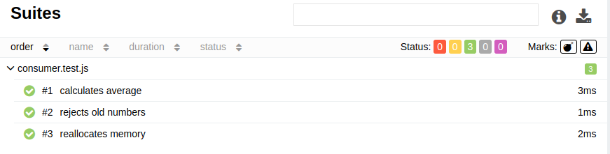

# Exercise Defenition

Implement the following class. The solution will be evaluated based on your choice of data structures and the algorithmic efficiency, so think about how your solution will behave as the frequency of calls to accept and mean grows. 

Keep in mind that a functional solution may not be efficient. To pass this screening exercise, you need to implement a correct and efficient solution.

Note that no React is expected in the solution, only base JavaScript.

```
class Consumer
{
  /**
   * Called periodically to consume an integer.
   */

  accept( number );

  /**
   * Returns the mean (aka average) of numbers consumed in the 
   * last 5 minute period.
   */

  mean();
}
```

# Algorithm Overview

The main idea is to retain two values: sum and count of non-expired numbers. Algorithm does it by holding numbers and its creation time in the queue.

## Accept request

When accept request is coming, number is added to sum and pused to the queue.

## Mean request

When mean request is coming, numbers are removed from queue and substracted from sum until its creation time is earlier than 5 minutes past now. The result is ratio between sum and queue length.

## Queue implementation

Queue can be implemented by using `push` and `shift` methods on `Array`. But `shift` operation has huge complexity, so I decided to do it another way. Removing element isn't necessary for calculating result, it's enough to store count of skipped elements. So it makes possible to call removing logic later by creating a macrotask. For better performance, elements are removing when count of expired numbers is greater than count of present numbers.

# Implementation stack

* EcmaScript version is ES2021/ES12
* Testing framework is Jest

# Tests

Execute `npm test` command to run tests.



[Allure Test Report](http://touchsoft-test-report.surge.sh/)
